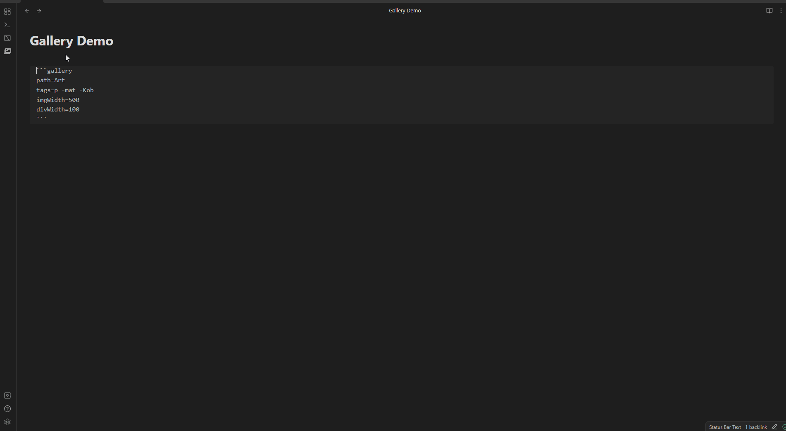
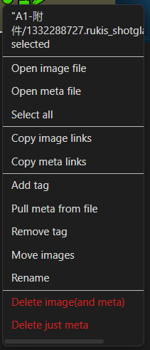
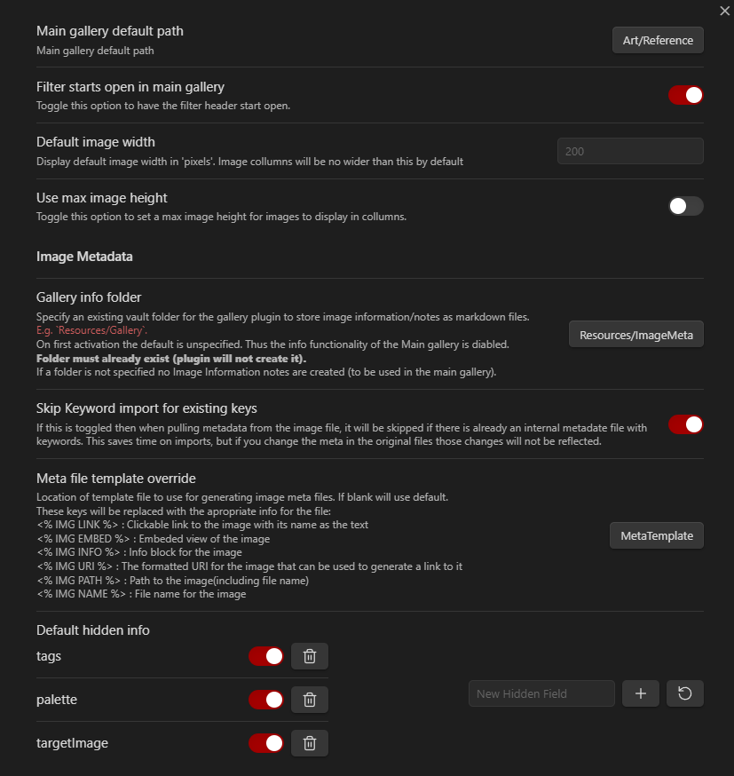

# Tagged Gallery

- Main Gallery to tag / filter / add notes to images.
- Filter by frontmatter criteria and change the meta right in the side panel
- Display blocks to embed images inside notes
- Display block to an image information

## Examples:

### [Main Gallery](https://github.com/TomNCatz/obsidian-gallery/blob/main/docs/README_MainGallery.md)

### [Display blocks](https://github.com/TomNCatz/obsidian-gallery/blob/main/docs/README_DisplayBlocks.md)

### [Meta Files and Templates](https://github.com/TomNCatz/obsidian-gallery/blob/main/docs/README_MetaFiles.md)

### [Context Menu](https://github.com/TomNCatz/obsidian-gallery/blob/main/docs/README_ContextMenu.md)

### Settings:

## [Tenative Roadmap](https://github.com/TomNCatz/obsidian-gallery/blob/main/docs/README_Roadmap.md)

# Release Notes
## 1.6.1
 - Fixing a bug with alternative tag fields that prevented proper search
 - Menu option to open the info panel when the info panel would not open automatically
 - Now remembers the last choice on the info panel toggle

## 1.6.0
 - GH#19 allow re-targeting tags field
 - GH#20 toggle for opening the info panel on click in the gallery

## 1.5.5
 - Switching from vault.rename to fileManager.renameFile as suggested by chat
 - Fixing a bug that caused the app to hang if you closed and reopened the vault with the gallery window already open
 - Fixed a bug where you could delete an image but it would still show in searches

## 1.5.4
 - Fixing more bugs with middle and context click
 - Fixing bug with leaving the sidebar open and reloading
 - gallery resumes state more correctly
 - partial support for remote media(only images so far and they don't show in the gallery yet)

This is a continuation of developement from Darakah's obsidian-gallery, found here https://github.com/Darakah/obsidian-gallery
