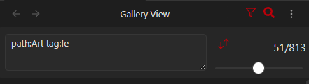

# Advanced Filter

The advanced filter allows you to build complex searches by following certain syntax.

Field selection is done with a field name and then a colon, with any criteria so search after the colon (eg. "tag:photo" to search for images tagged as photos)
path: path to search in (strict)
name: file name criteria (strict)
regex: custom search regex ({PATH} and {NAME} will be relaced with the path and name fields respectively)
tags: or tag: search for tags
<front-matter-field>: search a custom frontmatter field (eg. "Palette:000000" to search for images with black in them)

Tags and other frontmatter criteria also have some useful modifiers that can be added in front of a value to fine tune your filter
- !tag Strictly require this tag to be on the image   eg. "tag:!photo cat" will only show images tagged as a photo, even if that have cats in them
- -tag Exclude images that include this tag   eg. "tag:photo -cat" will only show photos that do not have the cat tag
- ^tag match case on this tag   eg. "tag:^Photo" will not include the 'photo' tag, only the 'Photo' tag

NOTE: At pressent, all frontmatter fields are treated as lists of strings(even if they are numbers, dates, or only have a single value) I hope to later include modifiers to better facilitate searching for numbers, dates, and colors. If you have specific use cases for those kinds of features please create feature requests for them so I can make sure they are included.