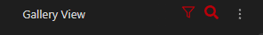
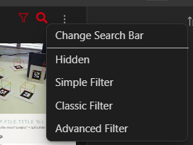
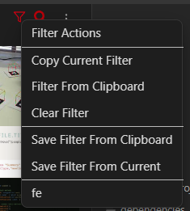

# Main Gallery
The top bar of the main gallery holds two useful menu buttons for gallery usage

## Search Bar
The first is the Search bar menu. This controls the visibility and structure of the search bar and has four options

- Hidden : No visiable search bar. Searches that have been entered are still in effect.
- Simple Filter : This filter has only one field, which is used for tags.
- Classic Filter : This filter has seperate fields for different search criteria and several options.
- [Advanced Filter](https://github.com/TomNCatz/obsidian-gallery/blob/main/docs/README_AdvancedSearch.md) : Like simple filter, the advanced filter has a single field, but it has many more things it can be used for

## Filter Menu
The filter menu has several options for managing your current search, and even saving and loading searches

- Copy current Filter copies the current filter to the clipboard as if to paste it into a note as a gallery block.
- Filter From Clipboard tries to use the current clipboard data to fill out the search bar(even if hidden)
- Clear Filter empies all filter fields
- Save Filter From Clipboard tries to build a named filter from the clipboard and save it
- Save Filter From Current saves the current filter as a named filter for later use
- Named filters are listed below these options. Named filters are also editable from the settings menu. Any fields not set by a filter will not be cleared when the filter is chosen, so you can create filters designed to alter your current search instead of only replacing it if you choose